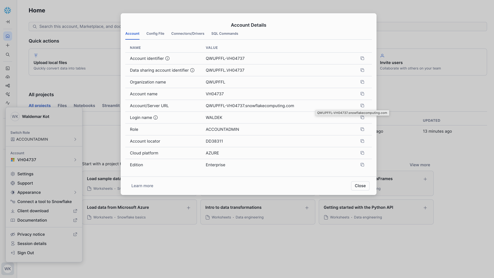
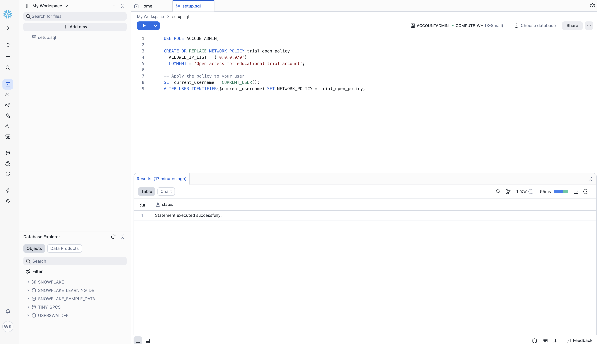
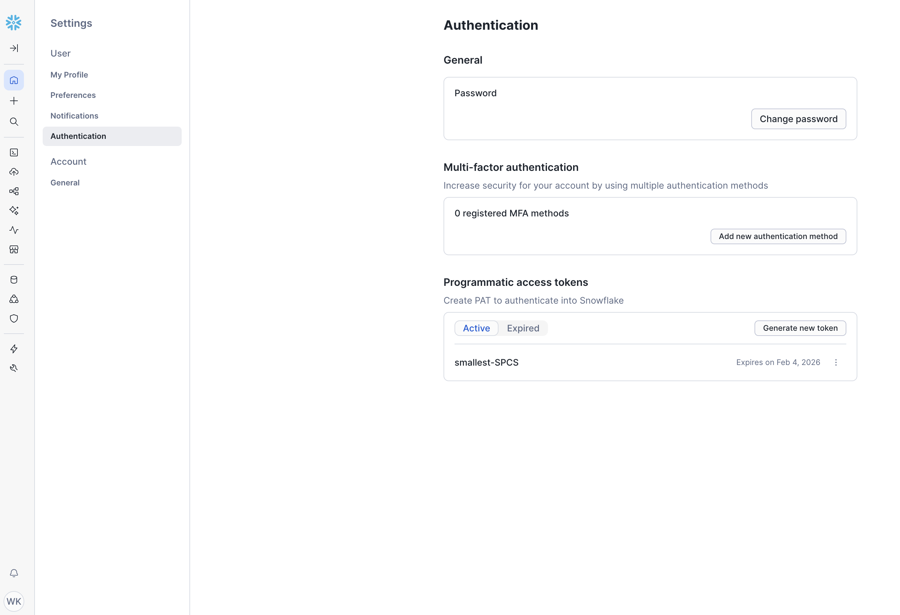
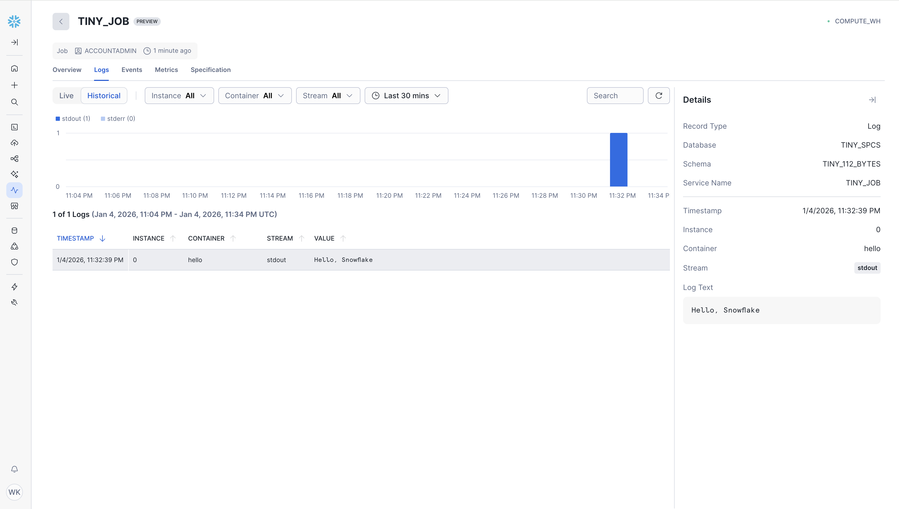

# Deploying the World's Smallest Container to Snowflake SPCS

This guide walks you through deploying a **112-byte executable** to Snowflake Snowpark Container Services (SPCS). This is the smallest possible 64-bit Linux ELF binary that prints "Hello, Snowflake" and exits successfully.

## Table of Contents

- [Overview](#overview)
- [Prerequisites](#prerequisites)
- [Deployment Steps](#step-1-create-a-snowflake-trial-account)
  - [Step 1: Create a Snowflake Trial Account](#step-1-create-a-snowflake-trial-account)
  - [Step 2: Configure Network Access](#step-2-configure-network-access-for-external-tools)
  - [Step 3: Install Snowflake CLI](#step-3-install-snowflake-cli)
  - [Step 4: Create a PAT Token](#step-4-create-a-programmatic-access-token-pat)
  - [Step 5: Configure Snow CLI](#step-5-configure-snow-cli-connection)
  - [Step 6: Validate Connectivity](#step-6-validate-connectivity)
  - [Step 7: Create Infrastructure](#step-7-create-snowflake-infrastructure)
  - [Step 8: Build and Push Docker Image](#step-8-build-and-push-docker-image)
  - [Step 9: Set Up Event Table](#step-9-set-up-event-table-for-logging)
  - [Step 10: Run the Job](#step-10-create-and-run-the-job)
  - [Step 11: Verify Output](#step-11-verify-the-output)
- [Cleanup](#cleanup)
- [Quick Reference](#quick-reference)
- [Automating with Claude Code](#automating-with-claude-code)
- [Troubleshooting](#troubleshooting)
- [Technical Details](#about-the-112-byte-binary)
  - [About the 112-Byte Binary](#about-the-112-byte-binary)
  - [Building From Source](#building-from-source)
  - [The 141-Byte Rosetta Version](#the-141-byte-rosetta-version)

---

## Overview

| Component | Size | Notes |
|-----------|------|-------|
| ELF Binary (Native Linux) | 112 bytes | For SPCS and native x86-64 Linux |
| ELF Binary (Rosetta/QEMU) | 141 bytes | For Docker on Mac (Apple Silicon) |
| Docker Image | ~112-141 bytes | Scratch base |
| Output | "Hello, Snowflake" | |

---

## Two Versions: Native vs Rosetta

This project includes **two binaries** that produce identical output:

| Binary | Size | Use Case |
|--------|------|----------|
| `hello_snowflake_64_112` | 112 bytes | **SPCS deployment**, native Linux x86-64 |
| `hello_snowflake_64_rosetta` | 141 bytes | **Local testing** on Docker for Mac (Apple Silicon) |

**Why two versions?** The 112-byte binary uses extreme header abuse tricks that work on native Linux but fail on QEMU/Rosetta emulation used by Docker on Mac. The 141-byte version uses compatible tricks.

---

## Why 112 Bytes is the Theoretical Minimum

For a **64-bit ELF on native modern Linux** (kernel 6.x), 112 bytes is the absolute minimum:

| Component | Size |
|-----------|------|
| ELF Header | 64 bytes |
| Program Header | 56 bytes |
| Header Overlap | -8 bytes |
| **Total** | **112 bytes** |

The math is simple:
- ELF header is exactly 64 bytes (fixed by spec)
- Program header is exactly 56 bytes for 64-bit ELF
- Maximum overlap is 8 bytes (program header starts at byte 56)
- **64 + 56 - 8 = 112 bytes**

All executable code is embedded within the headers themselves - there is literally no room for further reduction on 64-bit Linux.

> **Note**: Smaller 64-bit ELFs (89 bytes) exist for QEMU user-mode emulation, and 32-bit ELFs can be as small as 76 bytes, but for native 64-bit Linux containers, 112 bytes is the floor.

---

## Prerequisites

- Docker installed and running
- The 112-byte binary: `hello_snowflake_64_112` (included in this repo)

---

## Step 1: Create a Snowflake Trial Account

If you don't have a Snowflake account, create a free trial:

1. Go to [https://trial.snowflake.com/](https://trial.snowflake.com/)
2. Fill in your details and select:
   - **Cloud Provider**: Any (AWS, Azure, or GCP)
   - **Region**: Choose one close to you
   - **Edition**: Enterprise (recommended for SPCS)
3. Complete email verification
4. Log into Snowsight at the URL provided in your welcome email

Your account locator will be in the URL, e.g., `https://XXXXXX-YYYYY.snowflakecomputing.com` → account locator is `XXXXXX-YYYYY`.

You can also find your account details in Snowsight:

1. Click your username (bottom-left)
2. Click **Account** to open Account Details
3. Copy the **Account identifier** or **Account/Server URL**



---

## Step 2: Configure Network Access for External Tools

> **Important**: This step must be completed via Snowsight **before** the Snow CLI can connect. Trial accounts often block programmatic access by default.

Create a network policy to allow connections from external tools:

1. Log into Snowsight as ACCOUNTADMIN
2. Go to **Worksheets** → **+ Worksheet**
3. Run the following SQL:

```sql
USE ROLE ACCOUNTADMIN;

CREATE OR REPLACE NETWORK POLICY trial_open_policy
  ALLOWED_IP_LIST = ('0.0.0.0/0')
  COMMENT = 'Open access for educational trial account';

-- Apply the policy to your user
SET current_username = CURRENT_USER();
ALTER USER IDENTIFIER($current_username) SET NETWORK_POLICY = trial_open_policy;
```

> **Security Note**: This policy allows connections from any IP address. For production use, restrict `ALLOWED_IP_LIST` to specific IPs.



---

## Step 3: Install Snowflake CLI

### macOS (Homebrew)

```bash
brew install snowflake-cli
```

### macOS/Linux (pip)

```bash
pip install snowflake-cli
```

### Windows

```bash
pip install snowflake-cli
```

### Verify Installation

```bash
snow --version
```

For other installation methods, see the [official documentation](https://docs.snowflake.com/en/developer-guide/snowflake-cli/installation/installation).

---

## Step 4: Create a Programmatic Access Token (PAT)

PAT tokens allow secure, password-less authentication for CLI tools.

### 4.1 Generate Token in Snowsight

1. Log into Snowsight
2. Click your username (bottom-left) → **Settings**
3. Go to **User** → **Authentication**
4. Under **Programmatic access tokens**, click **Generate new token**
5. Configure the token:
   - **Name**: `smallest-SPCS` (or any descriptive name)
   - **Expires In**: 30 days (or your preference)
6. Click **Generate**
7. **Copy the token immediately** - it won't be shown again!



The token looks like: `eyJraWQiOiJhY2NvdW50...` (a long base64 string)

### 4.2 Save Token to File

Create a file named `.env-token` in the project directory and paste the token content:

**Option A - Using a text editor:**
1. Create a new file called `.env-token` in the project directory
2. Paste the token (the entire `eyJraWQi...` string) as the only content
3. Save the file

**Option B - Using terminal (macOS/Linux):**
```bash
# Paste your token between the quotes
echo "eyJraWQiOiJhY2NvdW50..." > .env-token
chmod 600 .env-token
```

**Option C - Using terminal (Windows PowerShell):**
```powershell
# Paste your token between the quotes
"eyJraWQiOiJhY2NvdW50..." | Out-File -FilePath .env-token -Encoding ASCII
```

> **Important**: The `.env-token` file is already in `.gitignore` to prevent accidental commits.

---

## Step 5: Configure Snow CLI Connection

Add a connection profile to your Snow CLI configuration:

```bash
# Create config directory if it doesn't exist
mkdir -p ~/.snowflake

# Add the connection (edit the file)
cat >> ~/.snowflake/config.toml << 'EOF'

[connections.spcs]
account = "YOUR_ACCOUNT_LOCATOR"
user = "YOUR_USERNAME"
host = "YOUR_ACCOUNT_LOCATOR.snowflakecomputing.com"
authenticator = "PROGRAMMATIC_ACCESS_TOKEN"
token_file_path = "/full/path/to/your/project/.env-token"
EOF
```

**Replace the placeholders:**
- `YOUR_ACCOUNT_LOCATOR`: e.g., `RQBSWTT-AE95171`
- `YOUR_USERNAME`: Your Snowflake username (e.g., `WKOT`)
- `/full/path/to/your/project/.env-token`: Absolute path to your token file

Example configuration:

```toml
[connections.spcs]
account = "RQBSWTT-AE95171"
user = "WKOT"
host = "RQBSWTT-AE95171.snowflakecomputing.com"
authenticator = "PROGRAMMATIC_ACCESS_TOKEN"
token_file_path = "/Users/wkot/projects/smallest-spcs/.env-token"
```

---

## Step 6: Validate Connectivity

Test your connection:

```bash
snow sql -c spcs -q "SELECT CURRENT_USER(), CURRENT_ACCOUNT(), CURRENT_ROLE();"
```

Expected output:

```
+------------------------------------------------------------------------------+
| CURRENT_USER() | CURRENT_ACCOUNT() | CURRENT_ROLE() |
|----------------+-------------------+----------------|
| YOUR_USERNAME  | YOUR_ACCOUNT      | ACCOUNTADMIN   |
+------------------------------------------------------------------------------+
```

If you see an error, check:
1. Token file path is absolute and correct
2. Token hasn't expired
3. Network policy is applied to your user
4. Account locator matches your Snowsight URL

---

## Step 7: Create Snowflake Infrastructure

### 7.1 Create Database and Schema

```bash
snow object create database name=TINY_SPCS --if-not-exists -c spcs
snow object create schema name=TINY_112_BYTES --database TINY_SPCS --if-not-exists -c spcs
```

### 7.2 Create Compute Pool

The compute pool provides the infrastructure to run containers:

```bash
snow spcs compute-pool create TINY_POOL \
  --min-nodes 1 \
  --max-nodes 1 \
  --family CPU_X64_XS \
  --auto-suspend-secs 300 \
  -c spcs
```

Wait for the compute pool to be ready:

```bash
snow spcs compute-pool describe TINY_POOL -c spcs --format JSON
```

The pool is ready when `state` shows `ACTIVE` or `IDLE`.

### 7.3 Create Image Repository

```bash
snow spcs image-repository create IMAGES \
  --database TINY_SPCS \
  --schema TINY_112_BYTES \
  -c spcs
```

Get the repository URL:

```bash
snow spcs image-repository url IMAGES \
  --database TINY_SPCS \
  --schema TINY_112_BYTES \
  -c spcs
```

This returns something like:
```
YOUR_ACCOUNT.registry.snowflakecomputing.com/tiny_spcs/tiny_112_bytes/images
```

---

## Step 8: Build and Push Docker Image

### 8.1 Create the Dockerfile

Create a `Dockerfile` in the same directory as the binary:

```dockerfile
# Minimal Docker image - scratch (empty) with 112-byte ELF
# For Snowflake Snowpark Container Services (SPCS)

FROM scratch

# Copy the 112-byte binary
COPY hello_snowflake_64_112 /hello_snowflake

# Run the binary - prints "Hello, Snowflake" and exits 0
CMD ["/hello_snowflake"]
```

### 8.2 Build the Image

```bash
docker build --platform linux/amd64 -t smallest_spcs:112bytes .
```

Verify the image size:

```bash
docker images smallest_spcs:112bytes
```

Expected output shows ~112 bytes (displayed as 112B or similar).

### 8.3 Test Locally

Before pushing to Snowflake, verify the container works.

**On Native Linux (x86-64):**

```bash
docker run --rm smallest_spcs:112bytes
```

**On macOS (Apple Silicon) - Use the Rosetta version for local testing:**

The 112-byte binary uses header tricks that don't work in Docker's QEMU/Rosetta emulation. For local testing on Mac, use the 141-byte Rosetta-compatible version:

```bash
# Test the Rosetta version locally
docker run --rm --platform linux/amd64 \
  -v "$(pwd):/work" -w /work \
  debian:bookworm-slim \
  sh -c './hello_snowflake_64_rosetta; echo "Exit: $?"'
```

> **Note**: The 112-byte version WILL work when deployed to SPCS (which runs on native Linux). The Rosetta version is only needed for local Docker testing on Mac.

Expected output:

```
Hello, Snowflake
Exit: 0
```

### 8.4 Tag for Snowflake Registry

Replace `YOUR_ACCOUNT` with your account locator:

```bash
docker tag smallest_spcs:112bytes \
  YOUR_ACCOUNT.registry.snowflakecomputing.com/tiny_spcs/tiny_112_bytes/images/smallest_spcs:112bytes
```

### 8.5 Authenticate to Snowflake Registry

```bash
snow spcs image-registry login -c spcs
```

### 8.6 Push the Image

```bash
docker push \
  YOUR_ACCOUNT.registry.snowflakecomputing.com/tiny_spcs/tiny_112_bytes/images/smallest_spcs:112bytes
```

Verify the image was pushed:

```bash
snow spcs image-repository list-images IMAGES \
  --database TINY_SPCS \
  --schema TINY_112_BYTES \
  -c spcs
```

---

## Step 9: Set Up Event Table for Logging

### 9.1 Create Event Table

```sql
CREATE EVENT TABLE IF NOT EXISTS TINY_SPCS.TINY_112_BYTES.EVENTS;
```

### 9.2 Associate Event Table with Database

```sql
ALTER DATABASE TINY_SPCS SET EVENT_TABLE = TINY_SPCS.TINY_112_BYTES.EVENTS;
ALTER DATABASE TINY_SPCS SET LOG_LEVEL = 'INFO';
```

Using the CLI:

```bash
snow sql -c spcs -q "CREATE EVENT TABLE IF NOT EXISTS TINY_SPCS.TINY_112_BYTES.EVENTS;"
snow sql -c spcs -q "ALTER DATABASE TINY_SPCS SET EVENT_TABLE = TINY_SPCS.TINY_112_BYTES.EVENTS;"
snow sql -c spcs -q "ALTER DATABASE TINY_SPCS SET LOG_LEVEL = 'INFO';"
```

---

## Step 10: Create and Run the Job

### 10.1 Create Service Specification

Create `tiny_spec.yaml`:

```yaml
spec:
  containers:
    - name: hello
      image: /tiny_spcs/tiny_112_bytes/images/smallest_spcs:112bytes
```

### 10.2 Execute the Job

Use `execute-job` for one-shot jobs (waits for completion):

```bash
snow spcs service execute-job TINY_JOB \
  --compute-pool TINY_POOL \
  --spec-path tiny_spec.yaml \
  --database TINY_SPCS \
  --schema TINY_112_BYTES \
  -c spcs
```

Expected output:
```
Job TINY_JOB completed successfully with status: DONE.
```

### 10.3 Check Job Details (Optional)

```bash
snow spcs service describe TINY_JOB \
  --database TINY_SPCS \
  --schema TINY_112_BYTES \
  -c spcs --format JSON
```

Verify `status` is `DONE` and `is_job` is `true`.

---

## Step 11: Verify the Output

### 11.1 View Container Logs

To see the actual output from the container:

```bash
snow spcs service logs TINY_JOB \
  --container-name hello \
  --instance-id 0 \
  --database TINY_SPCS \
  --schema TINY_112_BYTES \
  -c spcs
```

Expected output:

```
Hello, Snowflake
```

### 11.2 View Logs in Snowsight

You can also view container logs directly in the Snowsight UI:

1. Go to **Data Products** → **Apps** (or search for "TINY_JOB")
2. Click on **TINY_JOB**
3. Select the **Logs** tab
4. Click **Historical** to see past logs



The logs panel shows the "Hello, Snowflake" output from stdout with timestamp, container name, and instance details.

### 11.3 View Lifecycle Events (Optional)

The event table captures container lifecycle events:

```bash
snow sql -c spcs -q "
  SELECT TIMESTAMP, VALUE:message::STRING as message
  FROM TINY_SPCS.TINY_112_BYTES.EVENTS
  ORDER BY TIMESTAMP DESC
  LIMIT 10;
"
```

This shows the complete job lifecycle:
- `Compute pool node(s) are being provisioned`
- `Waiting to start`
- `Completed successfully`

---

## Cleanup

To remove all resources created by this guide:

```bash
snow spcs service drop TINY_JOB --database TINY_SPCS --schema TINY_112_BYTES -c spcs
snow spcs compute-pool drop TINY_POOL -c spcs
snow object drop database TINY_SPCS -c spcs
```

---

## Quick Reference

### All Commands in Order

```bash
# 1. Create infrastructure
snow object create database name=TINY_SPCS --if-not-exists -c spcs
snow object create schema name=TINY_112_BYTES --database TINY_SPCS --if-not-exists -c spcs
snow spcs compute-pool create TINY_POOL --min-nodes 1 --max-nodes 1 --family CPU_X64_XS --auto-suspend-secs 300 -c spcs
snow spcs image-repository create IMAGES --database TINY_SPCS --schema TINY_112_BYTES -c spcs

# 2. Wait for compute pool (check state is IDLE or ACTIVE)
snow spcs compute-pool describe TINY_POOL -c spcs --format JSON

# 3. Build and push image
docker build --platform linux/amd64 -t smallest_spcs:112bytes .
docker tag smallest_spcs:112bytes YOUR_ACCOUNT.registry.snowflakecomputing.com/tiny_spcs/tiny_112_bytes/images/smallest_spcs:112bytes
snow spcs image-registry login -c spcs
docker push YOUR_ACCOUNT.registry.snowflakecomputing.com/tiny_spcs/tiny_112_bytes/images/smallest_spcs:112bytes

# 4. Set up logging (requires SQL - no CLI equivalent)
snow sql -c spcs -q "CREATE EVENT TABLE IF NOT EXISTS TINY_SPCS.TINY_112_BYTES.EVENTS;"
snow sql -c spcs -q "ALTER DATABASE TINY_SPCS SET EVENT_TABLE = TINY_SPCS.TINY_112_BYTES.EVENTS; ALTER DATABASE TINY_SPCS SET LOG_LEVEL = 'INFO';"

# 5. Run the job
snow spcs service execute-job TINY_JOB --compute-pool TINY_POOL --spec-path tiny_spec.yaml --database TINY_SPCS --schema TINY_112_BYTES -c spcs

# 6. Verify
snow spcs service logs TINY_JOB --container-name hello --instance-id 0 --database TINY_SPCS --schema TINY_112_BYTES -c spcs
```

---

## About the 112-Byte Binary

The `hello_snowflake_64_112` binary is a hand-crafted x86-64 ELF executable that:

- Uses only 112 bytes (the theoretical minimum for a 64-bit ELF that prints output)
- Prints "Hello, Snowflake" to stdout
- Exits with code 0
- Runs on any modern Linux kernel (5.x+)

### Assembly Source Code

```nasm
; hello_snowflake_64_112.asm - 112-byte "Hello, Snowflake" ELF
; Build: nasm -f bin -o hello_snowflake_64_112 hello_snowflake_64_112.asm && chmod +x hello_snowflake_64_112

BITS 64
base equ 0x10000
ORG base

ehdr:
    db 0x7f, "ELF"
    db 2, 1, 1, 0           ; 64-bit, little-endian, ELF v1

frag1:                      ; e_ident[8-15] - Entry point!
    syscall                 ; Sets rcx = return address (0x1000a)
    pop rdi                 ; rdi = argc = 1 (stdout fd)
    push rcx                ; Push newline char (0x0a from rcx low byte)
    mov eax, edi            ; rax = 1 (write syscall)
    jmp short frag2

    dw 2                    ; e_type = ET_EXEC
    dw 0x3e                 ; e_machine = x86-64

exit_code:                  ; e_version - reused for exit code!
    mov al, 1               ; 32-bit exit syscall = 1
    int 0x80                ; exit(ebx) - ebx = 0 from kernel init

    dq frag1                ; e_entry - points to frag1
    dq phdr - ehdr          ; e_phoff = 56

frag2:                      ; e_shoff - reused for code!
    push qword [rcx + 0x5e] ; Push "nowflake" from p_align
    push qword [rcx + 0x46] ; Push "Hello, S" from p_paddr
    mov dl, 17              ; Length = 17 (16 chars + newline)

frag3:                      ; e_flags - reused for write syscall!
    push rsp
    pop rsi                 ; rsi = stack pointer (message)
    syscall                 ; write(1, "Hello, Snowflake\n", 17)

    dw 0xdeeb               ; e_ehsize = jmp -34 (back to exit_code)
    dw 56                   ; e_phentsize = 56

phdr:                       ; Program header (overlaps last 8 bytes of ELF header)
    dd 1                    ; p_type = PT_LOAD
    dd 5                    ; p_flags = PF_R | PF_X
    dq 0                    ; p_offset = 0
    dq base                 ; p_vaddr = 0x10000
    db "Hello, S"           ; p_paddr - string part 1!
    dq file_end - ehdr      ; p_filesz = 112
    dq file_end - ehdr      ; p_memsz = 112
    db "nowflake"           ; p_align - string part 2!

file_end:
; Total: 112 bytes (0x70)
```

### Size Reduction Techniques

The binary achieves 112 bytes through extreme header abuse:

| Technique | Description |
|-----------|-------------|
| **Header overlap** | Program header starts at byte 56, overlapping 8 bytes with ELF header |
| **Code in e_ident[8-15]** | Entry point code in padding bytes (Linux ignores bytes 8-15) |
| **Code in e_version** | Exit code stored in version field (not validated) |
| **Code in e_shoff** | String construction code in section header offset (no sections) |
| **Code in e_flags** | Write syscall in flags field (x86-64 ignores flags) |
| **Jump in e_ehsize** | Backward jump encoded as "header size" (not validated) |
| **String in p_paddr** | "Hello, S" in physical address (Linux ignores p_paddr) |
| **String in p_align** | "nowflake" in alignment field (any alignment accepted) |
| **syscall rcx trick** | After syscall, rcx holds RIP; low byte 0x0a = newline character |
| **argc as fd** | Pop argc (1) from stack as stdout file descriptor |
| **int 0x80 exit** | 32-bit syscall in 64-bit mode; ebx=0 from kernel → exit(0) |

---

## Building From Source

The assembly source code is provided in the [Assembly Source Code](#assembly-source-code) section above. Save it to `hello_snowflake_64_112.asm` and follow the instructions below.

### Native Linux

```bash
# Install NASM
sudo apt install nasm    # Debian/Ubuntu
sudo dnf install nasm    # Fedora/RHEL

# Compile (assumes hello_snowflake_64_112.asm exists)
nasm -f bin -o hello_snowflake_64_112 hello_snowflake_64_112.asm
chmod +x hello_snowflake_64_112

# Verify size and run
ls -l hello_snowflake_64_112    # Should be exactly 112 bytes
./hello_snowflake_64_112        # Output: Hello, Snowflake
```

### Using Docker (macOS/Windows)

If you don't have NASM installed locally:

```bash
# Compile and run in Docker (assumes hello_snowflake_64_112.asm exists)
docker run --rm --platform linux/amd64 \
  -v "$(pwd):/work" -w /work \
  debian:bookworm-slim \
  sh -c 'apt-get update -qq && apt-get install -qq -y nasm > /dev/null && \
         nasm -f bin -o hello_snowflake_64_112 hello_snowflake_64_112.asm && \
         chmod +x hello_snowflake_64_112 && \
         ls -l hello_snowflake_64_112 && \
         ./hello_snowflake_64_112'
```

### Quick Docker Test (Pre-built Binary)

If you already have the binary and just want to test it:

```bash
docker run --rm --platform linux/amd64 \
  -v "$(pwd):/work" -w /work \
  debian:bookworm-slim \
  sh -c './hello_snowflake_64_112 ; echo "Exit code: $?"'
```

Expected output:

```
Hello, Snowflake
Exit code: 0
```

---

## Automating with Claude Code

You can use [Claude Code](https://claude.ai/claude-code) (Anthropic's AI coding agent) to run through this entire guide automatically. This is useful for:

- Quick deployment to a new Snowflake trial account
- Validating the guide works end-to-end
- Learning how the commands work by watching Claude execute them

### Prerequisites

1. Clone this repository
2. Complete Steps 1-4 manually (account creation, network policy, CLI installation, PAT token)
3. Save your PAT token to `.env-token` in the project directory

### Example Prompt

Copy and modify this prompt for your Snowflake account:

```
Follow the instructions in @SPCS_DEPLOYMENT_GUIDE.md and perform the scenario end-to-end.

Snowflake account: RQBSWTT-AE95171.snowflakecomputing.com
User: wkot

Assumptions:
- Network policies have been configured to allow access from local Snow CLI
- PAT token is saved in .env-token
- For Snow CLI connection, use database and schema names from the document
- This test runs on native Linux (or use the Rosetta version for Mac)

Steps:
1. First validate Snow CLI connectivity
2. Then perform the smallest SPCS container deployment
3. Verify the output shows "Hello, Snowflake"
```

### What Claude Code Will Do

When given this prompt, Claude Code will:

1. **Configure Snow CLI** - Create/update `~/.snowflake/config.toml` with your connection details
2. **Validate connectivity** - Run `snow connection test -c spcs`
3. **Create infrastructure** - Database, schema, compute pool, and image repository
4. **Build and push** - Docker image with the 112-byte binary
5. **Execute the job** - Run the container on SPCS
6. **Verify output** - Check logs for "Hello, Snowflake"

### Customizing the Prompt

Replace these values with your own:

| Placeholder | Example | Description |
|-------------|---------|-------------|
| `RQBSWTT-AE95171` | `QWUPFFL-VH04737` | Your account locator |
| `wkot` | `waldek` | Your Snowflake username |

### Notes

- Claude Code will ask for permission before running commands
- The entire deployment typically completes in 5-10 minutes (mostly waiting for compute pool)
- If something fails, Claude Code can diagnose and retry

---

## Troubleshooting

### "Exec format error" on Docker for Mac

If you see this error when testing locally on macOS (especially Apple Silicon):

```
exec /hello_snowflake: exec format error
```

**This is expected!** The 112-byte binary uses header tricks that QEMU/Rosetta doesn't support. Solutions:

1. **For local testing**: Use the 141-byte Rosetta version:
   ```bash
   docker run --rm --platform linux/amd64 \
     -v "$(pwd):/work" -w /work \
     debian:bookworm-slim \
     sh -c './hello_snowflake_64_rosetta; echo "Exit: $?"'
   ```

2. **For SPCS deployment**: The 112-byte version WILL work on SPCS (native Linux). Deploy it directly without local testing.

### Compute Pool Not Starting

Check the pool status:
```bash
snow spcs compute-pool describe TINY_POOL -c spcs --format JSON
```

If stuck in `STARTING`, wait a few minutes. If `FAILED`, check your account's compute pool quota.

### Image Push Fails

1. Ensure you're logged in: `snow spcs image-registry login -c spcs`
2. Verify the repository exists: `snow spcs image-repository list --database TINY_SPCS --schema TINY_112_BYTES -c spcs`
3. Check the image tag matches the repository URL exactly

### No Output in Service Logs

If `snow spcs service logs` returns empty:

1. Verify the service completed: check status shows `DONE` with `lastExitCode: 0`
2. Ensure you're using the correct `--instance-id` (typically `0`)
3. The container may have crashed before producing output - check the service status message

### Job Shows Exit Code != 0

The binary requires a 64-bit Linux environment. Ensure:
- Docker image was built with `--platform linux/amd64`
- The binary has execute permissions (`chmod +x hello_snowflake_64_112`)

---

## The 141-Byte Rosetta Version

For testing on Docker for Mac (Apple Silicon), a 141-byte version is provided that works with QEMU/Rosetta emulation.

### Why 141 Bytes Instead of 112?

QEMU/Rosetta has stricter ELF validation than native Linux:

| Check | Native Linux | QEMU/Rosetta |
|-------|--------------|--------------|
| Code in e_ident[8-15] | ✓ Ignored | ✗ Rejected |
| Code in e_version | ✓ Ignored | ✗ Validated |
| Code in e_shoff | ✓ Ignored | ✗ Validated |
| Code in e_flags | ✓ Ignored | ✗ Validated |
| e_ehsize = jump instruction | ✓ Ignored | ✗ Validated |
| int 0x80 (32-bit exit) | ✓ Works | ✗ Segfaults |

The 29-byte difference is exactly the code that must be moved from header fields to after the headers.

### Shared Tricks (Work on Both)

| Trick | Description |
|-------|-------------|
| 8-byte header overlap | Program header at offset 56 |
| String in p_paddr | "Hello, S" stored in unused field |
| String in p_align | "nowflake" stored in alignment field |
| Stack-constructed string | Push parts, use stack as buffer |
| argc as stdout fd | Pop argc (1) as file descriptor |

### Rosetta Assembly Source

```nasm
; hello_snowflake_64_rosetta.asm - 141-byte "Hello, Snowflake" for QEMU/Rosetta
BITS 64
base equ 0x10000
ORG base

ehdr:
    db 0x7f, "ELF"
    db 2, 1, 1, 0           ; 64-bit, little-endian, ELF v1
    dq 0                    ; e_ident[8-15] padding (can't use for code)

    dw 2                    ; e_type = ET_EXEC
    dw 0x3e                 ; e_machine = x86-64
    dd 1                    ; e_version = 1 (must be valid)

    dq code                 ; e_entry - points to code after headers
    dq 56                   ; e_phoff = 56 (8-byte overlap)

    dq 0                    ; e_shoff = 0 (must be valid)
    dd 0                    ; e_flags = 0 (must be valid)
    dw 64                   ; e_ehsize = 64 (must be valid)
    dw 56                   ; e_phentsize = 56

phdr:                       ; Offset 56: 8-byte overlap zone
    dd 1                    ; p_type = PT_LOAD / e_phnum = 1
    dd 5                    ; p_flags = R|X

    dq 0                    ; p_offset = 0
    dq base                 ; p_vaddr
str1:
    db "Hello, S"           ; p_paddr = first 8 chars
    dq filesize             ; p_filesz
    dq filesize             ; p_memsz
str2:
    db "nowflake"           ; p_align = last 8 chars

code:                       ; Offset 112: CODE (29 bytes)
    pop     rdi             ; argc = 1 (stdout fd)
    push    0x0a            ; newline
    mov     eax, str1       ; load str1 address
    push    qword [rax+24]  ; push "nowflake"
    push    qword [rax]     ; push "Hello, S"
    mov     eax, edi        ; rax = 1 (sys_write)
    push    rsp
    pop     rsi             ; rsi = stack buffer
    push    17
    pop     rdx             ; rdx = 17
    syscall                 ; write(1, buf, 17)
    push    60
    pop     rax             ; rax = 60 (sys_exit)
    xor     edi, edi        ; rdi = 0
    syscall                 ; exit(0)

filesize equ $ - $$
; Total: 141 bytes
```

### Building the Rosetta Version

```bash
nasm -f bin -o hello_snowflake_64_rosetta hello_snowflake_64_rosetta.asm
chmod +x hello_snowflake_64_rosetta
```

### Testing Both Versions

```bash
# On native Linux - both work
./hello_snowflake_64_112      # 112 bytes
./hello_snowflake_64_rosetta  # 141 bytes

# On Docker for Mac - only Rosetta version works locally
docker run --rm --platform linux/amd64 \
  -v "$(pwd):/work" -w /work \
  debian:bookworm-slim \
  sh -c './hello_snowflake_64_rosetta; echo "Exit: $?"'
```
